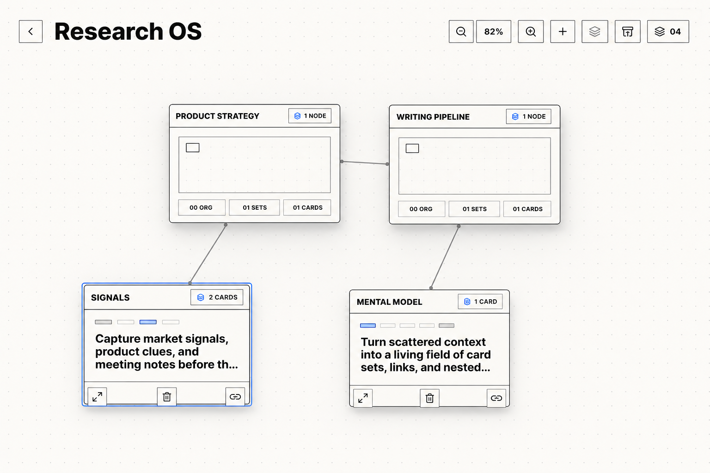
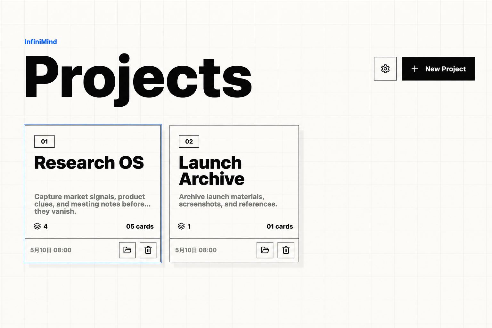
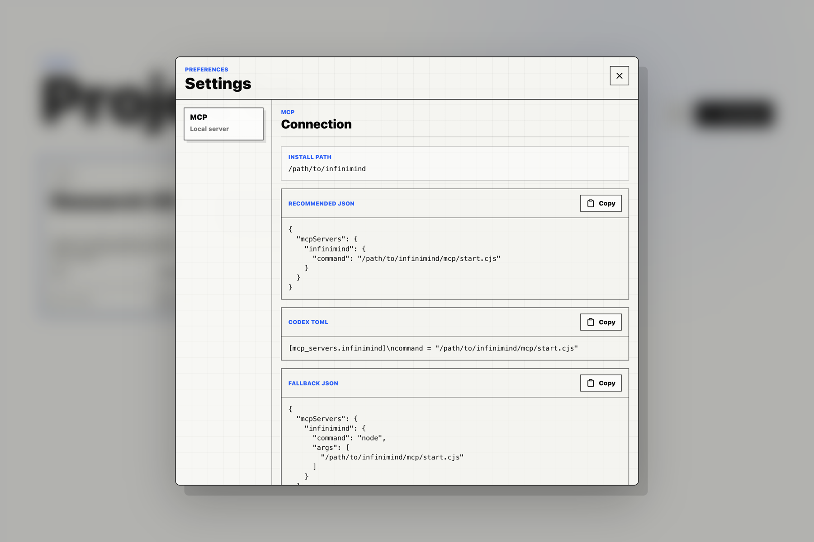

# InfiniMind



InfiniMind is a local-first canvas for turning loose thoughts into connected card fields. It combines a visual workspace, nested organizations, recoverable trash, image/link/attachment cards, and a local MCP server so AI clients can read, organize, and safely update the same workspace.

[中文说明](README.zh-CN.md)

## Highlights

- **Canvas-first thinking**: arrange card sets on a zoomable field, connect ideas, and move between overview and detail.
- **Nested organizations**: group related sets and child organizations into scoped workspaces without losing graph structure.
- **Multiple card types**: text, image, link, and attachment cards live together inside each set.
- **Recoverable edits**: cards, sets, and organizations move through trash before permanent deletion.
- **Desktop storage**: Electron stores workspace state and imported images locally.
- **MCP control surface**: AI clients can list projects, search, validate, create snapshots, apply dry-run batches, and write structured updates.

## Screenshots





## Getting Started

```sh
npm install
npm run dev
```

Open the Vite URL printed by the terminal, usually:

```text
http://127.0.0.1:5173/
```

Run the desktop app:

```sh
npm run desktop
```

Build for production:

```sh
npm run build
```

## MCP Setup

InfiniMind exposes a local stdio MCP server at:

```text
<InfiniMind install path>/mcp/start.cjs
```

The easiest setup path is **Settings -> MCP** in the desktop app. It generates JSON and Codex TOML snippets from the current install path.

You can also print the current machine's snippets:

```sh
npm run mcp:config
```

Generic MCP JSON shape:

```json
{
  "mcpServers": {
    "infinimind": {
      "command": "<InfiniMind install path>/mcp/start.cjs"
    }
  }
}
```

Codex TOML shape:

```toml
[mcp_servers.infinimind]
command = "<InfiniMind install path>/mcp/start.cjs"
```

For local MCP development:

```sh
npm run -s mcp
npm run mcp:inspect
```

## MCP Capabilities

The server includes read tools for project listing, project export, search, workspace validation, and snapshots. Write operations cover projects, sets, cards, connections, organizations, image imports, restore flows, and up to 50 batched operations through `infinimind_apply_operations`.

Safety model:

- Read tools are non-mutating.
- Write tools create an automatic SQLite snapshot before saving.
- Trash and delete operations require `confirm: true`.
- Permanent deletion requires `confirmText: "DELETE"`.
- Batch operations support `dryRun: true` before committing changes.

## Scripts

```sh
npm run dev          # Vite development server
npm run build        # production build
npm run desktop      # build and launch the Electron app
npm run mcp          # run the MCP server over stdio
npm run mcp:config   # print local MCP config snippets
npm run mcp:inspect  # inspect the MCP server
npm test             # run node:test suites
```

## Project Structure

```text
src/                  React app and canvas UI
src/lib/              Workspace model, normalization, validation helpers
electron/             Desktop shell, local SQLite state, image asset protocol
mcp/                  MCP server, tools, resources, prompts, operations
tests/                Workspace model and MCP storage tests
assets/               App icon assets
docs/screenshots/     README screenshot assets
```

## Notes

Set `INFINIMIND_USER_DATA_DIR=/path/to/user-data` when you want the MCP server to target a test workspace instead of the default Electron user data directory.
