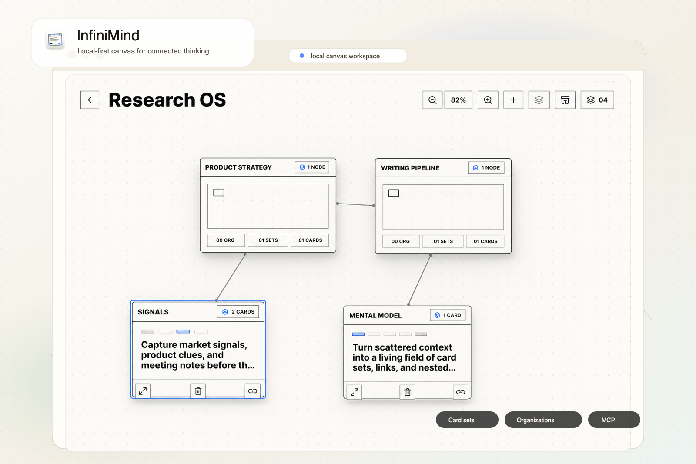
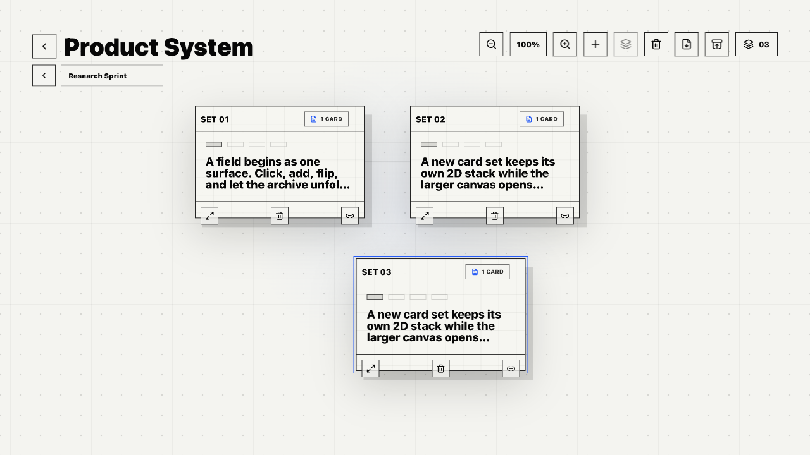

# InfiniMind



InfiniMind is a local-first thinking canvas for shaping loose ideas into connected card fields. Card sets stay tactile and inspectable; organizations appear as blurred clusters of schematic cards that suggest grouped material without exposing their internal layout on the parent canvas.

It is built for people and AI clients working in the same private workspace: a desktop canvas, nested organizations, recoverable trash, Markdown export, and a local MCP server all read and write the same local project data.

[中文说明](README.zh-CN.md)

## Highlights

- **Paper-like canvas**: work on a quiet grid with zoom, pan, named connections, selectable nodes, and compact controls that stay out of the way.
- **Clustered organizations**: turn related card sets or child organizations into stable scoped spaces. Each organization keeps a consistent blurred card-cluster mark on the parent canvas, no matter how complex the inside becomes.
- **Nested focus**: open an organization to enter its own field, move back through breadcrumbs, and move organizations out again without breaking scoped links.
- **Mixed card sets**: collect text, image, link, and attachment cards inside each set while keeping the overview readable.
- **Local desktop storage**: Electron stores workspace state in SQLite and keeps imported images as local files referenced by the workspace.
- **Recoverable edits**: cards, sets, and organization subtrees go through trash before permanent deletion.
- **AI-ready control surface**: MCP tools can list projects, search, validate, snapshot, dry-run batches, update structured content, and export projects as JSON or Markdown.

## Screenshots





## Getting Started

```sh
npm install
npm run dev
```

Open the Vite URL printed by the terminal, usually:

```text
http://127.0.0.1:5173/
```

Run the desktop app:

```sh
npm run desktop
```

Build for production:

```sh
npm run build
```

## Desktop Workflow

- Create projects from the project library.
- Add card sets to the field, then open a set to edit individual cards.
- Select multiple nodes and create an organization from the selection.
- Double-click an organization cluster to enter its scoped canvas.
- Use breadcrumbs to move between root and nested organizations.
- Export the active project as Markdown from the field toolbar.
- Switch appearance from **Settings -> Appearance**.

## MCP Setup

InfiniMind exposes a local stdio MCP server at:

```text
<InfiniMind install path>/mcp/start.cjs
```

The easiest setup path is **Settings -> MCP** in the desktop app. It generates JSON and Codex TOML snippets from the current install path.

You can also print the current machine's snippets:

```sh
npm run mcp:config
```

Generic MCP JSON shape:

```json
{
  "mcpServers": {
    "infinimind": {
      "command": "<InfiniMind install path>/mcp/start.cjs"
    }
  }
}
```

Codex TOML shape:

```toml
[mcp_servers.infinimind]
command = "<InfiniMind install path>/mcp/start.cjs"
```

For local MCP development:

```sh
npm run -s mcp
npm run mcp:inspect
```

## MCP Capabilities

The server includes read tools for project listing, project export, Markdown export, search, workspace validation, graph views, and snapshots. Write operations cover projects, sets, cards, named connections, organizations, image imports, restore flows, and up to 50 batched operations through `infinimind_apply_operations`.

Safety model:

- Read tools are non-mutating.
- Write tools create an automatic SQLite snapshot before saving.
- Trash and delete operations require `confirm: true`.
- Permanent deletion requires `confirmText: "DELETE"`.
- Batch operations support `dryRun: true` before committing changes.

## Scripts

```sh
npm run dev          # Vite development server
npm run build        # production build
npm run desktop      # build and launch the Electron app
npm run mcp          # run the MCP server over stdio
npm run mcp:config   # print local MCP config snippets
npm run mcp:inspect  # inspect the MCP server
npm test             # run node:test suites
```

## Project Structure

```text
src/                  React app and canvas UI
src/lib/              Workspace model, normalization, validation, Markdown export helpers
electron/             Desktop shell, local SQLite state, image asset protocol
mcp/                  MCP server, tools, resources, prompts, operations
tests/                Workspace model, MCP, and export tests
assets/               App icon assets
docs/screenshots/     README screenshot assets
```

## Notes

Set `INFINIMIND_USER_DATA_DIR=/path/to/user-data` when you want the MCP server to target a test workspace instead of the default Electron user data directory.
