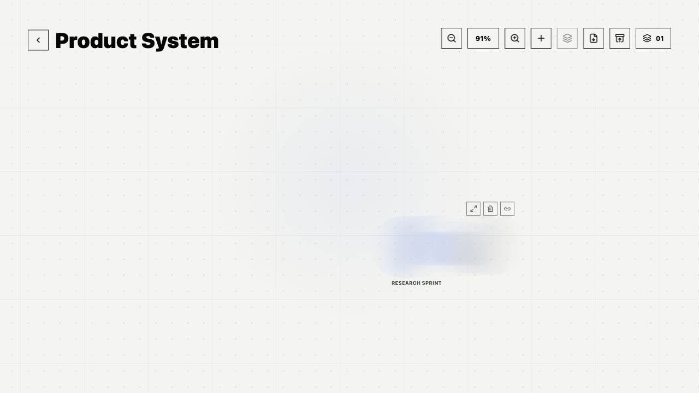

# InfiniMind



InfiniMind 是一个本地优先的思维画布，用来把零散想法整理成可连接、可缩放、可进入的卡片场。Card set 保持像纸面卡片一样可检查；organization 则显示成几张示意卡片聚合后的模糊标记，在父级画布上提示里面有成组内容，但不暴露真实内部布局。

它适合人和 AI 客户端一起使用同一份私有工作区：桌面画布、嵌套 organization、可恢复回收站、Markdown 导出、本地 MCP Server 都读写同一份本地项目数据。

[English README](README.md)

## 亮点

- **纸面式画布**：在安静网格上缩放、拖拽、命名连线、选择节点，紧凑工具栏不会打断工作流。
- **聚合 organization**：把相关 card set 或子 organization 收进稳定的作用域。无论内部变得多复杂，父级画布上都保持统一的模糊卡片簇标记。
- **嵌套聚焦**：打开 organization 进入它自己的 field，通过面包屑返回，也可以把 organization 移出分组并保留作用域连接。
- **混合 card set**：同一个 set 中可以放文字、图片、链接和附件，同时保持总览清爽。
- **本地桌面存储**：Electron 使用 SQLite 保存工作区状态，并把导入图片作为本地文件引用。
- **可恢复编辑**：card、set、organization 子树都会先进入 Trash，再执行永久删除。
- **AI 友好的控制面**：MCP 工具可以列出项目、搜索、校验、快照、dry-run 批量操作、写入结构化内容，并导出 JSON 或 Markdown。

## 截图


## 快速开始

```sh
npm install
npm run dev
```

打开终端输出的 Vite 地址，通常是：

```text
http://127.0.0.1:5173/
```

运行桌面端：

```sh
npm run desktop
```

构建生产版本：

```sh
npm run build
```

## 桌面工作流

- 从项目列表创建或打开 project。
- 在 field 上添加 card set，再打开 set 编辑单张 card。
- 选择多个节点后创建 organization。
- 双击 organization 卡片簇进入它的 scoped canvas。
- 通过面包屑在 root 和嵌套 organization 之间移动。
- 从 field 工具栏把当前 project 导出为 Markdown。
- 在 **Settings -> Appearance** 切换外观主题。

## MCP 配置

InfiniMind 的本地 stdio MCP Server 入口是：

```text
<InfiniMind install path>/mcp/start.cjs
```

最简单的配置方式是在桌面端打开 **Settings -> MCP**，应用会根据当前安装路径生成 JSON 和 Codex TOML 片段。

也可以在命令行输出当前机器的配置：

```sh
npm run mcp:config
```

通用 MCP JSON 结构：

```json
{
  "mcpServers": {
    "infinimind": {
      "command": "<InfiniMind install path>/mcp/start.cjs"
    }
  }
}
```

Codex TOML 结构：

```toml
[mcp_servers.infinimind]
command = "<InfiniMind install path>/mcp/start.cjs"
```

本地开发 MCP：

```sh
npm run -s mcp
npm run mcp:inspect
```

## MCP 能力

Server 提供项目列表、项目导出、Markdown 导出、搜索、工作区校验、图视图、快照等读取工具；写入能力覆盖 project、set、card、命名 connection、organization、图片导入、恢复流程，以及通过 `infinimind_apply_operations` 执行最多 50 步的批量操作。

安全模型：

- 读取工具不会修改数据。
- 写入工具保存前会自动创建 SQLite 快照。
- Trash 和删除操作需要 `confirm: true`。
- 永久删除需要 `confirmText: "DELETE"`。
- 批量操作支持先用 `dryRun: true` 预览结果。

## 常用脚本

```sh
npm run dev          # Vite 开发服务器
npm run build        # 生产构建
npm run desktop      # 构建并启动 Electron 桌面端
npm run mcp          # 通过 stdio 运行 MCP Server
npm run mcp:config   # 输出本机 MCP 配置片段
npm run mcp:inspect  # 检查 MCP Server
npm test             # 运行 node:test 测试
```

## 项目结构

```text
src/                  React 应用和画布 UI
src/lib/              工作区模型、归一化、校验、Markdown 导出辅助逻辑
electron/             桌面壳、本地 SQLite 状态、图片资源协议
mcp/                  MCP server、tools、resources、prompts、operations
tests/                工作区模型、MCP 和导出测试
assets/               应用图标资源
docs/screenshots/     README 截图素材
```

## 备注

如果希望 MCP Server 指向测试工作区，而不是默认 Electron 用户数据目录，可以设置：

```sh
INFINIMIND_USER_DATA_DIR=/path/to/user-data
```
